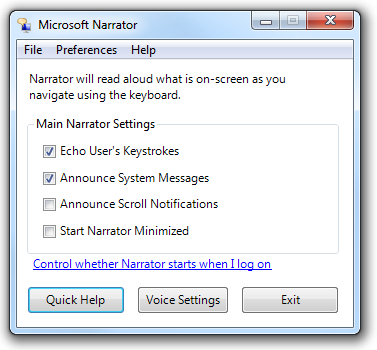
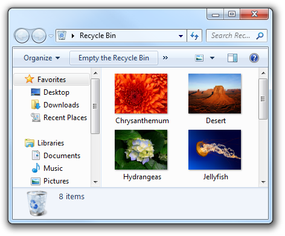
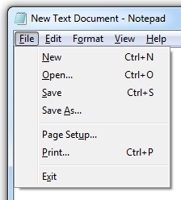
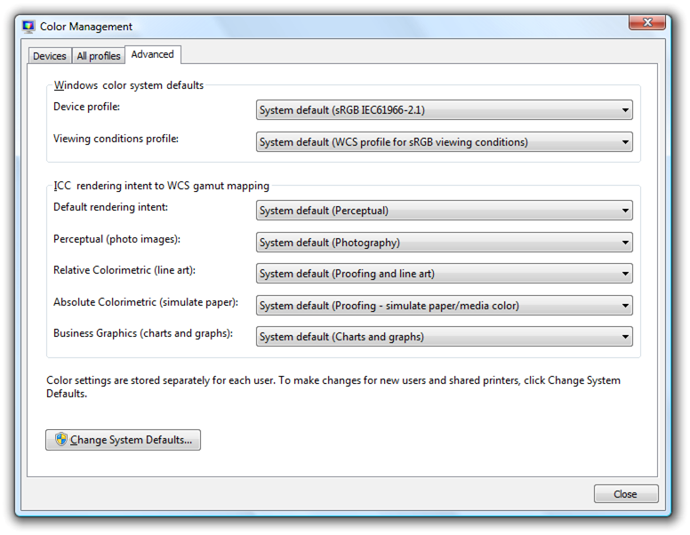
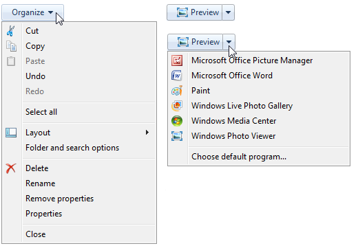
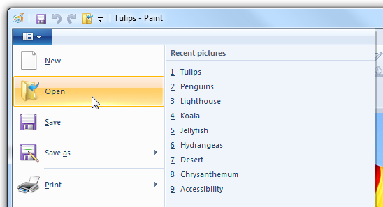
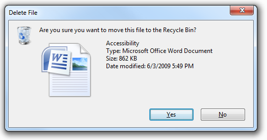
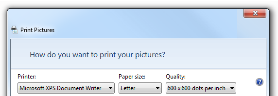

# Accessibility

Designing software for accessibility means ensuring that programs and functionality are easily available to the widest range of users, including those who have disabilities and impairments.

The number of users that accessibility features can help may surprise you; for example, in the United States, surveys have shown that more than half of all computer users experience difficulties or impairments related to accessibility, and are likely to benefit from the use of accessible technology. Moreover, approaching software design with the flexibility and inclusiveness that are the hallmarks of accessibility often results in overall improved usability and customer satisfaction.

The Ease of Access Center, available from Control Panel, provides a central location where users can choose and customize the accessibility features they want.

**Note:** Guidelines related to [keyboard](inter-keyboard.md), [mouse](inter-mouse.md), [color](vis-color.md), and [sound](vis-sound.md) are presented in separate articles.

## Design concepts

Many physical, perceptual, and cognitive factors come into play when users interact with computer hardware and software. Before considering ways to make your program's features more accessible, it helps to learn about what kinds of disabilities and impairments exist, and some of the assistive technologies these users may be working with as they interact with computers.

### Types of impairments

The following table describes common user disabilities and impairments, and lists a few of the most important solutions used to make computers more accessible.

|                               |                                                                                                                                                                                                         |                                                                                                                                                                                       |
|-------------------------------|---------------------------------------------------------------------------------------------------------------------------------------------------------------------------------------------------------|---------------------------------------------------------------------------------------------------------------------------------------------------------------------------------------|
| **Impairment**      | **Description**                                                                                                                                                                               | **Solutions**                                                                                                                                                               |
| Visual              | Ranges from mild (affecting 17 percent of users) to severe (affecting 9 percent of users).                                                                                                    | Customizable magnification, colors, and contrast; Braille utilities; screen readers.                                                                                        |
| Hearing             | Ranges from mild (affecting 18 percent of users) to severe (affecting 2 percent of users).                                                                                                    | Information redundancy: sound used only as supplement to text or visual communication.                                                                                      |
| Dexterity           | Ranges from mild (affecting 19 percent of users) to severe (affecting 5 percent of users). This impairment often involves difficulty performing certain motor skills with keyboard or mouse.  | Input method redundancy: program features accessed by mouse or keyboard equivalents.                                                                                        |
| Cognitive           | Includes memory impairments and perceptual differences. Affects 16 percent of users.                                                                                                          | Highly-customizable user interface (UI); use of [progressive disclosure](ctrl-progressive-disclosure-controls.md) to hide complexity; use of icons and other visual aids.  |
| Seizure             | Includes visual sensitivity to movement and flashing.                                                                                                                                         | Conservative approach to modulating interfaces, such as the use of animations; avoiding screen flicker in the range between 2 Hertz (Hz) and 55 Hz.                         |
| Speech or language  | Includes dyslexia and oral communication difficulties.                                                                                                                                        | Spell-check and grammar-check utilities; speech recognition and text-to-speech technology.                                                                                  |

 

For more guidelines about helping users with these impairments, see [Addressing particular impairments](#addressing-particular-impairments) later in this article.

### Types of assistive technologies and accessibility features

**Screen readers**

A screen reader enables users with visual disabilities or impairments to navigate a UI by transforming visuals to audio. Thus, UI text, controls, menus, toolbars, graphics, and other screen elements are spoken by the computerized voice of the screen reader. To create a program optimized for screen reader assistive technology, you must plan for how the screen reader will identify each UI element.

Each UI element that the user can interact with must be keyboard accessible, as well as be exposed through an accessibility application programming interface (API). We recommend using UI Automation, the new accessibility framework for all versions of Microsoft Windows that support Windows Presentation Foundation (WPF). UI Automation provides programmatic access to most elements on the desktop, enabling assistive technology products such as screen readers to provide information about the UI to users and to manipulate the UI by means other than standard input (for example, by speaking rather than or in addition to manipulating the mouse or keyboard). For more information, see the [UI Automation Overview](http://msdn2.microsoft.com/library/ms747327.aspx).

Be aware that although screen readers are a very important assistive technology, there are others as well. For more information about the range of technologies available, see [Types of Assistive Technology Products](http://www.microsoft.com/enable/at/types.aspx).

**Speech recognition**

Speech recognition is an accessibility feature in Windows that allows users to interact with their computers by voice, reducing the need for motor interaction with the mouse or keyboard. Users can dictate documents and e-mail, use voice commands to start and switch between programs, control the operating system, and even fill out forms on the Web.

**Magnifier**

Magnification helps users with low vision by enlarging items on screen anywhere from 2 to 16 times the original. Users can set this feature to track the mouse (to see an enlarged version of what the mouse is pointing to), the keyboard (to see the area where the pointer moves when tabbing), or text editing (to see what they are typing).

**Visual settings and color schemes**

In addition to making things on the screen larger, users with visual impairment may benefit from system settings such as [high-contrast mode](glossary.md) or the ability to customize background and foreground color schemes.

**Narrator**

Narrator is a scaled-down screen reader in Windows that allows users to hear on-screen text and UI elements read aloud, even including some events (including error messages) that happen spontaneously. The user can hear the Narrator menus without leaving the active window.

Users can customize the extent to which Microsoft Narrator is used.

**On-screen keyboard**

For users who have difficulty with physical keyboards, and need to use an alternative input device such as a switch, on-screen keyboards are a necessity. Users can select keys using the mouse or another pointing device, a small group of keys, or just one key, depending on how you set up On-Screen Keyboard.

**Mouse keys**

With Mouse Keys enabled, users who prefer the keyboard can use the arrow keys on the numeric keypad to move the mouse pointer.

For a complete list of accessibility features, see [Accessibility in Windows Vista](http://www.microsoft.com/enable/products/windowsvista/default.aspx) on the Microsoft Web site.

### Keyboard-based navigation

The Tab key, arrow keys, space bar, and Enter key are important for keyboard-based navigation. Pressing Tab cycles [input focus](glossary.md) through the different control groups, and pressing the arrow keys moves within a control or among controls within a group. Pressing space bar is the same as clicking the control with input focus, whereas pressing Enter is the same as clicking the default command button or command link, regardless of input focus.

In this example, users can press Tab until the desired option has input focus, then press Enter to open the object.

### Access keys

Access keys allow users to choose options and initiate commands directly without having to navigate to the control first. Access keys are indicated by underlining one of the characters in each control's label. Users then activate the option or command by pressing the Alt key along with the underlined character. Access keys aren't case sensitive.

In this example, pressing Alt+O activates the Open command.

Choosing logical access keys for controls usually poses no difficulty; the more controls there are on a window, however, the greater the possibility you will run out of access key choices. In this case, assign access keys to control groups rather than each individual one.

In this example, access keys are assigned to control groups, rather than individual controls.

Access keys are often confused with shortcut keys, but shortcut keys are assigned differently from access keys and have different goals. For example, shortcut keys use Ctrl and Function key sequences and are intended primarily as a shortcut for advanced users instead of for accessibility.

For more information, see [Keyboard](inter-keyboard.md).

### Designing for accessibility: three fundamental practices

Accessible programs help all users in some way because the objectives of accessibility and usability overlap. For example, features designed to make advanced users as efficient as possible also benefit users who prefer using the keyboard because of dexterity impairment.

Three fundamental practices will help you with accessible design: allow for a degree of flexibility in your UI, let respect for user needs and preferences play a major role in design decisions, and provide programmatic access to your UI.

**Providing flexible UI**

Accessible design is, at least in part, about giving users choices. Not a frustrating, dizzying array of choices, but a limited number of choices that smartly anticipates user needs. "Don't like navigating by way of the mouse? Here, you can do the very same things using only the keyboard. Don't like physical keyboards? Here's a virtual one you can use on-screen."

For example, provide flexibility by:

-   Providing user-selectable equivalents for non-text elements (for example, alt text for graphics and captions for audio).

    

    

    Users who have chosen not to render graphics should see alt text instead, describing what the control does and how to interact with it.

-   Providing alternatives to color (for example, icon differentiation or the use of sounds).

    

    In this example, the standard icons are readily distinguishable based on their designs.

-   Ensuring keyboard access (for example, a tab stop for every interactive control) so that users can accomplish the same things in your program with either the mouse or the keyboard.
-   Ensuring that your program offers good color contrast options for users. Windows provides a high contrast option, but that's really designed to be a solution for severe visual impairment. Other contrast options best serve users with mild impairment, such as low vision and color blindness.
-   Ensuring that users have a way to adjust the size of text in your program's UI (for example, through a slider control or drop-down box for font size). If possible, support high dots per inch (dpi) mode.
-   Ensuring that your program is multimodal, meaning that if the primary mode of the program is inaccessible for some, these users have a way to work around the problem. For example, when animation is displayed, the information should be displayable in at least one non-animated presentation mode at the option of the user.

Multimodal interfaces and flexible navigation essentially offer the user the architecture of information redundancy. Redundancy sometimes has negative connotations; in user interface text, for example, we advise removing redundancy to streamline the reading experience. But in the context of accessibility, redundancy connotes positive, fail-safe mechanisms and experiences.

**Respecting your users**

Respect as a general, guiding principle is vital for designing accessible programs. Even as an intellectual exercise, imagine what it must be like to encounter your program as a user who is disabled. Take the time to test UI screens in high contrast mode and at various resolutions, to ensure the experience is a good one for users with visual impairments. Test keyboard accessibility by selecting the **Underline keyboard shortcuts and access keys** check box in the Ease of Access Center Control Panel item (so that access keys are always visible). You can even go beyond rigorous testing by hiring developers and designers who have a natural aptitude for empathizing with others to begin with.

You should also demonstrate respect by:

-   Using system-wide settings (for example, System Color) rather than hardwiring settings for your particular program. Respect not only the parameters that users have specifically selected for interacting with their programs, but also accessibility features built into the operating system that the user wants in effect no matter which program they are using. For more information, see [About Windows Accessibility Features](http://msdn2.microsoft.com/library/ms695605.aspx).
-   Preferring common controls to custom controls, because common controls have already implemented the Windows accessibility APIs.
-   Documenting all accessibility options and features (for example, all keyboard shortcuts). Users with impairments are highly motivated to discover accessibility features, and often expect comprehensive information to be collected in Help.
-   Creating accessible documentation in accessible formats. Thus, the documentation itself should adhere to the same rules of accessibility as the primary UI, including the ability to enlarge font size, the use of alt text for graphics, and redundant information architecture (for example, using color-coding only as a supplement to text).

In software products, respect for users may manifest itself in usability and market research, in efficacious support services and documentation, and of course in design decisions. For example, thinking again in terms of design for advanced users: are you putting that cutting-edge new feature in because you want it, or because you know that your advanced users have been asking for it? The latter case indicates that your design decision-making process is well-informed by the value of respect.

**Providing programmatic access**

Providing programmatic access to the UI is essential so that assistive technologies (such as screen readers, alternative input devices, and speech recognition programs) interpret the screen correctly for their users. By creating a "map" of each UI screen in your program, you make it available to users of assistive technologies.

Do this well by:

-   Enabling programmatic access to all UI elements and text (for example, using the Active Accessibility COM interface, [**IAccessible**](https://msdn.microsoft.com/library/windows/desktop/dd318466)).
-   Placing names (or titles) and descriptions on UI objects, frames, and pages (for example, using the [**IAccessible**](https://msdn.microsoft.com/library/windows/desktop/dd318466) Name property).
-   Ensuring programmatic events are triggered by all UI activities (for example, focus events for all UI activities involving focus movement).

**If you do only four things...**

1.  Ensure every user can leverage the full potential of your program.
2.  Think of accessibility as an opportunity for creative problem-solving and another means of increasing overall user satisfaction.
3.  Respect system settings.
4.  Use common controls whenever possible.

## Guidelines

### General

-   **Don't disrupt or disable activated features of the operating system or other products that are identified as accessibility features.** You can identify these features by referring to the documentation of the operating system or product in question.
-   **Don't force users to interact with your program as the top window on the screen.** If a function or a window is required continuously for users to perform a task, that window should always remain visible, if the user so chooses, regardless of its position relative to other windows. For example, if the user has a movable on-screen keyboard that is on top of all other windows so that it is visible at all times, your program should never obscure it by mandatory placement at the top of the [Z order](glossary.md).
-   **Use system colors, fonts, and common controls whenever possible.** By doing so, you significantly reduce the number of accessibility issues users encounter.

### Addressing particular impairments

**Visual**

-   **Never rely on color alone to convey meaning.** Use color only as a means of reinforcing the meaning provided by text, design, location, or sound.

    

    The primary method of communication in this example is the concise tooltip text. The use of color assists in communicating the meaning, but is secondary.

-   **Use alternative (alt) text infotips to describe graphics.**
-   **Don't use text in graphics.** Users with visual impairments may have graphics turned off (for example, in a Web browser), or may simply not see or look for text placed in graphics.
-   **Ensure that dialog boxes and windows have meaningful names,** so that a user who is hearing rather than seeing the screen (for example, using a screen reader) gets appropriate contextual information.
-   **Respect the user's settings for visual display** by always obtaining font typefaces, sizes, and colors, Windows display element sizes, and system configuration settings from the Theme and GetSystemMetrics APIs.
-   **Keep balloon text concise** so that it is easier to read and minimizes disruption to screen readers.

    

    Although balloons may use additional body text if necessary, this example shows that sometimes title text alone achieves the same goal in a more economical and accessible way.

**Hearing**

-   **Never rely on sound alone to convey meaning.** Use sound only as a means of reinforcing the meaning provided by text, design, location, or color.
-   **Enable users to control the volume of audio output.** Use the Windows Volume Mixer for this purpose. For more information, see [Sound](vis-sound.md).
-   **Target your program's sound to occur in a range between 500 Hz and 3000 Hz** or be easily adjustable by the user into that range. Sounds in this range are most likely to be detectable by people with hearing impairment.

**Dexterity**

-   **Make UI timeout values relative to GetDoubleClickTime() instead of using absolute times.** Doing so adjusts the timeouts to the speed of the user.
-   **Assign access keys to all menu items** so that users who prefer working with the keyboard have the same ability to navigate your program as users who work with the mouse.
-   **Don't make double-clicking and dragging the only way to perform an action.** These can be difficult movements for some users.
-   **Don't remove menu bars from your program.** Menu bars are easier than toolbars for keyboard users to access. If you don't want the menu bar visible by default, hide it instead.
-   **Make Help accessible from the keyboard by providing tab stops for Help buttons and links.**
-   **To improve awareness of the access key assignments in your program, you can display them at all times.** In Control Panel, go to the Ease of Access Center, and click **Make the keyboard easier to use**; then select the **Underline keyboard shortcuts and access keys** check box.

**Cognitive**

-   **Use progressive disclosure** to hide complexity.

    

    In these examples, options available from the command button are hidden by default, and users can choose to view the options by taking advantage of progressive disclosure controls.

-   **Use icons, toolbars, and other visual aids** to reduce cognitive load of reading text.
-   When possible, **provide auto-complete functionality in text boxes and editable drop-down lists**, so that users don't have to type the entire name of commands, file names, or similar choices from a limited set of options. This reduces cognitive load for all users, and reduces the amount of typing for users for whom spelling or typing is difficult, slow, or painful.
-   **Demonstrate difficult concepts in Help by including tutorials and animations.** Note that animations can be difficult for users with seizure impairment, and therefore should be used only when necessary.

**Seizure**

-   **Don't use flashing or blinking text, objects, or other elements having a flash or blink frequency in the range between 2-55 Hz.**
-   **Limit use of animations.** Some users are particularly sensitive to screen movement, especially in the periphery of their visual field. If you use animation to draw attention to something, make sure that attention is deserved and worthy of interrupting the user.

**Speech or language**

-   **Organize and write clear, concise, easily understood text.** Usability tests show that unfolding key information at the end of a phrase improves comprehension. For more guidelines, see [Style and Tone](text-style-tone.md).

**Incorrect:**

Is three the next digit?

Click OK to begin.

**Correct:**

Is the next digit three?

To begin, click OK.

### Access keys

-   **Prefer characters with wide widths,** such as w, m, and capital letters.
-   **Prefer a distinctive consonant or a vowel,** such as "x" in "Exit."
-   **Avoid using characters that make the underline difficult to see,** such as (from most problematic to least problematic):
    -   Characters that are only one pixel wide, such as i and l.
    -   Characters with descenders, such as g, j, p, q, and y.
    -   Characters next to a letter with a descender.

### Menu access keys

-   **Assign access keys to all menu items.** No exceptions.
-   **For dynamic menu items (such as recently used files), assign access keys numerically.**

    

    In this example, the Paint program in Windows assigns numeric access keys to recently used files.

-   **Assign unique access keys within a menu level.** You can reuse access keys across different menu levels.
-   **Make access keys easy to find:**
    -   For the most frequently used menu items, choose characters at the beginning of the first or second word of the label, preferably the first character.
    -   For less frequently used menu items, choose letters that are a distinctive consonant or a vowel in the label.

### Dialog box access keys

-   **Whenever possible, assign unique access keys to all interactive controls or their labels.**[Read-only text boxes](ctrl-text-boxes.md) are interactive controls (because users can scroll them and copy text), so they benefit from access keys. **Don't assign access keys to:**
    -   **OK, Cancel, and Close buttons.** Enter and Esc are used for their access keys. However, always assign an access key to a control that means OK or Cancel, but has a different label.

        

        In this example, the positive commit button has an access key assigned.

-   **Group labels.** Normally, the individual controls within a group are assigned access keys, so the group label doesn't need one. However, assign an access key to the group label and not the individual controls if there is a shortage of access keys.
-   **Generic Help buttons,** which are accessed with F1.
-   **Link labels.** There are often too many links to assign unique access keys, and link underscores hide the access key underscores. Have users access links with the Tab key instead.
-   **Tab names.** Tabs are cycled using Ctrl+Tab and Ctrl+Shift+Tab.
-   **Browse buttons labeled "...".** These can't be assigned access keys uniquely.
-   **Unlabeled controls,** such as spin controls, graphic command buttons, and unlabeled progressive disclosure controls.
-   **Non-label static text or labels for controls that aren't interactive,** such as progress bars.
-   **Assign commit button access keys first to ensure that they have the standard key assignments.** If there isn't a standard key assignment, use the first letter of the first word. For example, the access key for Yes and No commit buttons should always be "Y" and "N", regardless of the other controls in the dialog box.
-   **For negative commit buttons (other than Cancel) phrased as a "Don't", assign the access key to the "n" in "Don't".** If not phrased as a "Don't", use the standard access key assignment or assign the first letter of the first word. By doing so, all Don'ts and No's have a consistent access key.
-   **To make access keys easy to find, assign the access keys to a character that appears early in the label,** ideally the first character, even if there is a keyword that appears later in the label.

For more guidelines and examples, see [Keyboard](inter-keyboard.md).

## Text

-   **Use colons at the end of external control labels.** Some assistive technologies look for colons to identify control labels.
-   **Position labels consistently relative to the elements that they are labeling.** This helps assistive technology correctly associate the labels with their corresponding controls, and helps users of screen enlargers know where to look for a label or control.

    

    In this example, the labels for each of the drop-down lists are placed consistently and use colons.

-   **Limit alt text to 150 characters maximum.** Describe the action to activate the control (for example, click, right-click, and so on) and then describe the control's function.

    **Acceptable:**

    Button.

    Blue hills.

    **Better:**

    Click to sign in to your account.

    Photo of distant hills showing how colors fade over distance.

-   **Don't use text to draw lines, boxes or other graphical symbols.** Characters used in this way can confuse users of screen readers. For example, a box drawn with the letter "X" around an area of text is read by screen-reader software as "X X X X X X" on the first line, followed by "X" and the content and "X".

## Documentation

-   Document all accessibility options and features (for example, all keyboard shortcuts).
-   Create accessible documentation in accessible formats. Thus, the documentation itself should adhere to the same rules of accessibility as the primary UI.
-   Refer to access keys, not shortcut keys (which have a different meaning and use), mnemonic keys, or accelerators.
-   In general, refer to a person with a kind of disability, not a disabled person. Consider the person first, not the label.

|                                                               |                                                                                  |
|---------------------------------------------------------------|----------------------------------------------------------------------------------|
| **Use these terms**                                 | **Instead of**                                                         |
| Has limited dexterity, has motion disabilities      | Crippled, lame                                                         |
| Without disabilities                                | Normal, able-bodied, healthy                                           |
| One-handed, people who type with one hand           | Single-handed                                                          |
| People with disabilities                            | The disabled, disabled people, people with handicaps, the handicapped  |
| Cognitive disabilities, developmental disabilities  |                                                                                  |

 

 

 

