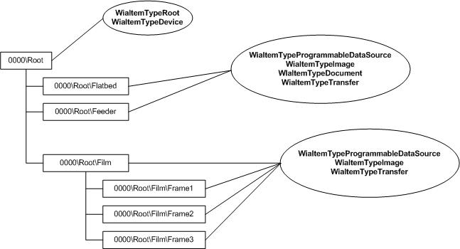
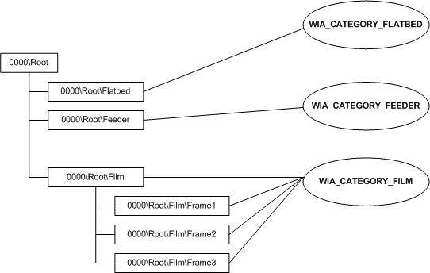

# About the IWiaItem2 Item Tree

With Windows Vista, the Windows Image Acquisition (WIA) item tree has changed significantly. [**IWiaItem2**](-wia-iwiaitem2.md) items are used to represent device attributes and device data. Imaging applications see a Windows Image Acquisition (WIA) 2.0 device as a hierarchical tree of items, with the root item representing the device itself and the child items representing things like programmable data sources, images, or folders that contain images.

-   [Application Items](#application-items)
-   [Item Flags](#item-flags)
-   [Item Categories](#item-categories)
-   [Root Item](#root-item)
-   [Data Item](#data-item)
-   [Related topics](#related-topics)

## Application Items

The WIA 2.0 item tree that an application can see is separate from the tree created and maintained by a WIA 2.0 minidriver. When a minidriver creates a tree, the WIA 2.0 service uses this WIA 2.0 item tree as a guide to create a copy of the tree that can be viewed by imaging applications. Items in the copied tree are called *application* items. Items in the tree created by a minidriver are called *driver* items.

A WIA item can represent a programmable data source for a scanner's document feeder or the data stored on that device. A WIA device should be divided into individual items that describe different data produced by that device.

For example, a WIA scanner that supports both flatbed scanning and document feeder scanning might be divided into two child items. One represents the flatbed scanning functionality and the other represents the document feeder scanning functionality.

Multiple images laid out on a flatbed scanner and scanned at the same time can be placed in one folder. Using the segmentation filter ([**IWiaSegmentationFilter**](-wia-iwiasegmentationfilter.md)), each image or subregion can then be created as a child item of the folder.

The WIA tree for a camera device that stores photos ("Film") can be divided into items that represent folders, subfolders, and photos.

## Item Flags

WIA item flags help classify the content or supported behavior of a particular WIA item. WIA item flags fall into two groups.

1.  Item status flags report the current state of the WIA item, for example, [**WiaItemTypeDisconnected**](-wia-wia-item-type-flags.md), **WiaItemTypeDeleted**, and so forth.
2.  Item data representation/usage flags report the data that the WIA item represents or can produce if transferred. For example, [**WiaItemTypeImage**](-wia-wia-item-type-flags.md) is a data representation flag that tells the application the data associated with the current WIA item is image data and should have image data properties. **WIA\_IPA\_ITEM\_FLAGS** is an item usage flag that tells the application that the WIA item is configurable and follows a set of predefined configuration rules based on the [**WIA\_IPA\_ITEM\_CATEGORY**](-wia-wiaitempropcommonitem.md) and that the configuration can possibly change the result for each data transfer. (For more information about category definitions, see [Item Categories](#item-categories) item categories.)

The following graphic shows an example of a WIA item tree and the various flags that might be associated with each item.

## Item Categories

WIA items are grouped into categories using the [**WIA\_IPA\_ITEM\_CATEGORY**](-wia-wiaitempropcommonitem.md) property values. These categories define how a WIA item is to be treated or used. For example, if the item represents a finished file (WIA\_CATEGORY\_FINISHED\_FILE), a WIA application should assume that the data is static and located on the device. If the item represents a feeder (WIA\_CATEGORY\_FEEDER), the application should expect it to contain the required document feeder properties and operate like a document feeder.

The categories defined by WIA are:

-   WIA\_CATEGORY\_AUTO
-   WIA\_CATEGORY\_FEEDER
-   WIA\_CATEGORY\_FILM
-   WIA\_CATEGORY\_FINISHED\_FILE
-   WIA\_CATEGORY\_FLATBED

For example, a scanner's flatbed item may have the [**WIA\_IPA\_ITEM\_FLAGS**](-wia-wiaitempropcommonitem.md) set to [**WiaItemTypeImage**](-wia-wia-item-type-flags.md), **WiaItemTypeTransfer**, and**WiaItemTypeProgrammableDataSource**, and the **WIA\_IPA\_ITEM\_CATEGORY** property set to WIA\_CATEGORY\_FLATBED.

The following table shows WIA category grouping with item flags and WIA items. This table does not include a full list of the WIA item flags defined by WIA.

<table>
<colgroup>
<col style="width: 25%" />
<col style="width: 25%" />
<col style="width: 25%" />
<col style="width: 25%" />
</colgroup>
<thead>
<tr class="header">
<th>WIA Category</th>
<th>Valid WIA Item Flags</th>
<th>WIA Property Set</th>
<th>WIA Items</th>
</tr>
</thead>
<tbody>
<tr class="odd">
<td>WIA_CATEGORY_AUTO</td>
<td><ul>
<li>[<strong>WiaItemTypeProgrammableDataSource</strong>](-wia-wia-item-type-flags.md)</li>
<li>[<strong>WiaItemTypeImage</strong>](-wia-wia-item-type-flags.md)</li>
<li>[<strong>WiaItemTypeTransfer</strong>](-wia-wia-item-type-flags.md)</li>
<li>[<strong>WiaItemTypeFile</strong>](-wia-wia-item-type-flags.md)</li>
</ul></td>
<td>Property set includes auto-configured scanner properties.</td>
<td>WIA auto item that represents the scanner's auto-configured scanning settings.</td>
</tr>
<tr class="even">
<td>WIA_CATEGORY_FEEDER</td>
<td><ul>
<li>[<strong>WiaItemTypeProgrammableDataSource</strong>](-wia-wia-item-type-flags.md)</li>
<li>[<strong>WiaItemTypeImage</strong>](-wia-wia-item-type-flags.md)</li>
<li>[<strong>WiaItemTypeDocument</strong>](-wia-wia-item-type-flags.md)</li>
<li>[<strong>WiaItemTypeTransfer</strong>](-wia-wia-item-type-flags.md)</li>
<li>[<strong>WiaItemTypeFolder</strong>](-wia-wia-item-type-flags.md)</li>
</ul></td>
<td>Property set includes feeder scanner control properties (usually image and document specific property set).</td>
<td>WIA Feeder items, including child items that represent the front and back pages of a document.</td>
</tr>
<tr class="odd">
<td>WIA_CATEGORY_FILM</td>
<td><ul>
<li>[<strong>WiaItemTypeProgrammableDataSource</strong>](-wia-wia-item-type-flags.md)</li>
<li>[<strong>WiaItemTypeImage</strong>](-wia-wia-item-type-flags.md)</li>
<li>[<strong>WiaItemTypeTransfer</strong>](-wia-wia-item-type-flags.md)</li>
<li>[<strong>WiaItemTypeFolder</strong>](-wia-wia-item-type-flags.md)</li>
</ul></td>
<td>Property set includes film scanner control properties (usually image and document specific property set).</td>
<td>WIA Film items, including child items that represent the individual scanning frames.</td>
</tr>
<tr class="even">
<td>WIA_CATEGORY_FINISHED_FILE</td>
<td><ul>
<li>[<strong>WiaItemTypeFolder</strong>](-wia-wia-item-type-flags.md)</li>
<li>[<strong>WiaItemTypeImage</strong>](-wia-wia-item-type-flags.md)</li>
<li>[<strong>WiaItemTypeAudio</strong>](-wia-wia-item-type-flags.md)</li>
<li>[<strong>WiaItemTypeVideo</strong>](-wia-wia-item-type-flags.md)</li>
<li>[<strong>WiaItemTypeDocument</strong>](-wia-wia-item-type-flags.md)</li>
<li>[<strong>WiaItemTypeTransfer</strong>](-wia-wia-item-type-flags.md)</li>
</ul></td>
<td>The property set on this item depends on the item type reported. For example, [<strong>WiaItemTypeImage</strong>](-wia-wia-item-type-flags.md) should include some image item properties, like bits per pixel and so forth.</td>
<td>WIA storage items, including child items that represent finished file content (data files like JPEG, HTML, TXT, and so forth).</td>
</tr>
<tr class="odd">
<td>WIA_CATEGORY_FLATBED</td>
<td><ul>
<li>[<strong>WiaItemTypeProgrammableDataSource</strong>](-wia-wia-item-type-flags.md)</li>
<li>[<strong>WiaItemTypeImage</strong>](-wia-wia-item-type-flags.md)</li>
<li>[<strong>WiaItemTypeDocument</strong>](-wia-wia-item-type-flags.md)</li>
<li>[<strong>WiaItemTypeTransfer</strong>](-wia-wia-item-type-flags.md)</li>
<li>[<strong>WiaItemTypeFolder</strong>](-wia-wia-item-type-flags.md)—may be present if the scanner supports multi-item scanning.</li>
<li>[<strong>WiaItemTypeGenerated</strong>](-wia-wia-item-type-flags.md)—may be present if the application generates a WIA item during a multi-item scanning session.</li>
</ul></td>
<td>The property set includes flatbed scanner control properties (usually image and document specific property set).</td>
<td>WIA flatbed items, including child items that represent regions being scanned on the scanner's flatbed platen.</td>
</tr>
</tbody>
</table>

 

The following graphic shows an example of a WIA item tree and the various categories that might be associated with each item.

## Root Item

A WIA root item is a folder item marked with [**WiaItemTypeRoot**](-wia-wia-item-type-flags.md) and **WiaItemTypeDevice** flags that represents the device itself. It contains device attributes like manufacturer, device name, and driver attributes like driver version and user interface class identifier (CLSID). Imaging applications get the root to the WIA item tree by calling [**IWiaDevMgr2::CreateDevice**](-wia-iwiadevmgr2-createdevice.md) method. The application uses the root item to gain access to the individual child WIA items by enumerating the tree (see [**IEnumWiaItem2**](-wia-ienumwiaitem2.md)).

## Data Item

Any item that can be use to transfer data is considered a data item. This includes items marked with the [**WiaItemTypeProgrammableDataSource**](-wia-wia-item-type-flags.md) flag.

Folder items and nonfolder items can expose the ability to transfer data by being marked with the [**WiaItemTypeTransfer**](-wia-wia-item-type-flags.md) flag. Any item with this flag set has to provide the following WIA item properties:

-   [**WIA\_IPA\_ACCESS\_RIGHTS**](-wia-wiaitempropcommonitem.md)
-   [**WIA\_IPA\_ITEM\_SIZE**](-wia-wiaitempropcommonitem.md)
-   [**WIA\_IPA\_BUFFER\_SIZE**](-wia-wiaitempropcommonitem.md)
-   [**WIA\_IPA\_FORMAT**](-wia-wiaitempropcommonitem.md)
-   [**WIA\_IPA\_PREFERRED\_FORMAT**](-wia-wiaitempropcommonitem.md)
-   [**WIA\_IPA\_TYMED**](-wia-wiaitempropcommonitem.md)
-   [**WIA\_IPA\_FILENAME\_EXTENSION**](-wia-wiaitempropcommonitem.md)

Programmable data source items marked with the [**WiaItemTypeTransfer**](-wia-wia-item-type-flags.md) flag must also supply the data item required property set.

WIA data items may have additional properties depending on the item's flag settings. For example, WIA items marked with the [**WiaItemTypeImage**](-wia-wia-item-type-flags.md) flag should have image specific information properties, like [**WIA\_IPA\_DEPTH**](-wia-wiaitempropcommonitem.md) and **WIA\_IPA\_NUMBER\_OF\_LINES**.

## Related topics

<dl> <dt>

**Reference**
</dt> <dt>

[**IWiaItem2**](-wia-iwiaitem2.md)
</dt> <dt>

[**IEnumWiaItem2**](-wia-ienumwiaitem2.md)
</dt> <dt>

[**IWiaDevMgr2**](-wia-iwiadevmgr2.md)
</dt> </dl>

 

 

