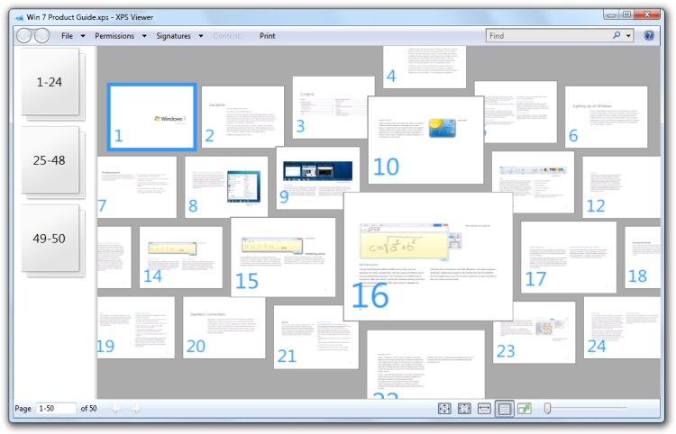

# Documents and Document Peripherals

Windows 7 provides developers with a robust platform for working with documents and integrating document peripherals. Two new document and storage technologies were introduced in Windows Vista: the XML Paper Specification (XPS) and Open Packaging Conventions (OPC). These technologies, which were available in Windows Vista only to developers of managed-code applications through the Microsoft .NET Framework, are now available in the Windows 7software development kit (SDK) for use by developers of unmanaged code.

## Open Packaging Conventions

Windows 7 supports all OPC file formats, including those from Microsoft as well as those from third parties. OPC is a component of the Office Open XML (OOXML) international specification defined through *ISO/IEC DIS 29500* and *ECMA-376*. Based on the *ZIP* file format, OPC enables applications to store a combination of data items within a single package file. Application developers can use the *Packaging*APIs in Windows 7 to create, read, and manipulate multiple data elements in OPC-based files.

Using the *Packaging*APIs in Windows 7, developers can create new package formats to accommodate application-specific data storage requirements.

*X509* digital signatures are also supported by the *Packaging*APIs. Developers can use the digital signature features to sign and validate selected parts of an OPC package or the entire package. Applications can give their documents an added level of security by using digital signatures to detect when the content of an OPC-based file has been altered after the file was signed. (See [Open Packaging Conventions Overview](http://go.microsoft.com/?linkid=9669685).)

## XPS Documents

Windows application developers can create applications that produce XPS documents with Windows 7. This enables them to integrate tightly with the document peripheral ecosystem (devices like scanners and printers) and to work with secure electronic paper to support publication and archiving.

In previous versions of Windows, XPS was not supported for Microsoft Win32 developers. XPS was introduced in Windows Vista but the API surface was limited to .NET developers working with managed code. With Windows 7, Win32 developers can use the new XPS*Document*APIs to reduce the amount of work required when working with XPS. Since XPS is the foundation for the new Windows print platform, that's a significant benefit.

In previous versions of Windows, access to the XPS print path from Win32 applications was limited to driver escapes. This significantly reduced the utility of the print path for developers not using managed code. For Win32 developers, the new XPS*Print*API reduces significantly the amount of work required to benefit from the advantages of the XPS print path and eliminates the need for parallel print code.

Application developers can use XPS documents to share and archive content as electronic paper in a high-fidelity, efficient, and trustworthy format. Just like Windows Vista, the print path in Windows 7 is built on the XPS format to provide enhanced printing capabilities. The XPS document APIs in Windows 7 give developers the power to create, access, and manipulate XPS documents easily. (See [XPS Document Programming Guide](http://go.microsoft.com/?linkid=9669688).)

Windows application developers can create applications that produce XPS documents with Windows 7

 

 

