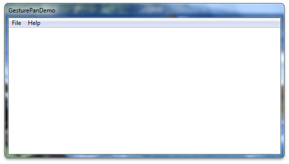
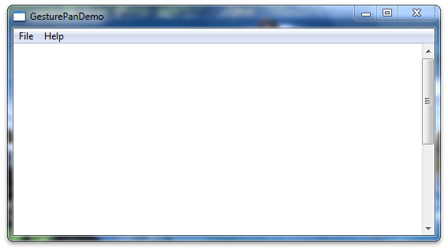
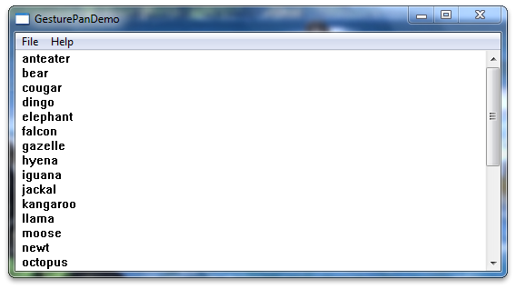

# Legacy Support for Panning with Scroll Bars

This section describes support for panning using scroll bars in Windows-based applications.

In Windows 7, panning gestures generate WM\_\*SCROLL messages to enable legacy support for panning. Because your applications may not support all of the WM\_\*SCROLL messages, panning may not work correctly. This topic describes the steps you must take to ensure that the legacy panning experience in applications functions as users expect.

## Overview

The following sections explain how to enable the legacy panning experience:

-   Create an application with scroll bars.
-   Disable flicks.
-   Customize the panning experience.

## Create an Application with Scroll Bars

Start a new Win32 project using the Microsoft Visual Studio wizard. Make sure the application type is set to the Windows application. You don't need to enable support for the Active Template Library (ATL). The following image shows what your project will look like after you have started it.



Next, enable scroll bars on the image. Change the window creation code in **InitInstance** so that the [**CreateWindow**](https://msdn.microsoft.com/library/windows/desktop/ms632679) function call creates a window with scroll bars. The following code shows how to do this.


```C++
   hWnd = CreateWindow(
      szWindowClass, 
      szTitle, 
      WS_OVERLAPPEDWINDOW | WS_VSCROLL,  // style
      200,                               // x
      200,                               // y
      550,                               // width
      300,                               // height
      NULL,
      NULL,
      hInstance,
      NULL
    );  
```


After you have changed the window creation code, your application will have a scroll bar. The following image shows how the application might look at this point.



After you have changed the window creation code, add a scroll bar object to your application and some text to scroll. Place the following code into the top of the **WndProc** method.


```C++
    TEXTMETRIC tm;     
    SCROLLINFO si; 
     
    // These variables are required to display text. 
    static int xClient;     // width of client area 
    static int yClient;     // height of client area 
    static int xClientMax;  // maximum width of client area 
     
    static int xChar;       // horizontal scrolling unit 
    static int yChar;       // vertical scrolling unit 
    static int xUpper;      // average width of uppercase letters 
     
    static int xPos;        // current horizontal scrolling position 
    static int yPos;        // current vertical scrolling position 
     
    int i;                  // loop counter 
    int x, y;               // horizontal and vertical coordinates
     
    int FirstLine;          // first line in the invalidated area 
    int LastLine;           // last line in the invalidated area 
    HRESULT hr;
    int abcLength = 0;  // length of an abc[] item

    int lines = 0;

    // Create an array of lines to display. 
    static const int LINES=28;
    static LPCWSTR abc[] = { 
       L"anteater",  L"bear",      L"cougar", 
       L"dingo",     L"elephant",  L"falcon", 
       L"gazelle",   L"hyena",     L"iguana", 
       L"jackal",    L"kangaroo",  L"llama", 
       L"moose",     L"newt",      L"octopus", 
       L"penguin",   L"quail",     L"rat", 
       L"squid",     L"tortoise",  L"urus", 
       L"vole",      L"walrus",    L"xylophone", 
       L"yak",       L"zebra",
       L"This line contains words, but no character. Go figure.",
       L""
     };        
```


Next, implement the application logic for configuring the text calculations for text metrics. The following code should replace the existing **WM\_CREATE** case in the **WndProc** function.


```C++
    case WM_CREATE : 
        // Get the handle to the client area's device context. 
        hdc = GetDC (hWnd); 
 
        // Extract font dimensions from the text metrics. 
        GetTextMetrics (hdc, &amp;tm); 
        xChar = tm.tmAveCharWidth; 
        xUpper = (tm.tmPitchAndFamily & 1 ? 3 : 2) * xChar/2; 
        yChar = tm.tmHeight + tm.tmExternalLeading; 
 
        // Free the device context. 
        ReleaseDC (hWnd, hdc); 
 
        // Set an arbitrary maximum width for client area. 
        // (xClientMax is the sum of the widths of 48 average 
        // lowercase letters and 12 uppercase letters.) 
        xClientMax = 48 * xChar + 12 * xUpper; 
 
        return 0;
```


Next, implement the application logic for recalculation of the text block when the window is resized. The following code should be placed into the message switch in **WndProc**.


```C++
    case WM_SIZE: 
 
        // Retrieve the dimensions of the client area. 
        yClient = HIWORD (lParam); 
        xClient = LOWORD (lParam); 
 
        // Set the vertical scrolling range and page size
        si.cbSize = sizeof(si); 
        si.fMask  = SIF_RANGE | SIF_PAGE; 
        si.nMin   = 0; 
        si.nMax   = LINES - 1; 
        si.nPage  = yClient / yChar; 
        SetScrollInfo(hWnd, SB_VERT, &amp;si, TRUE); 
 
        // Set the horizontal scrolling range and page size. 
        si.cbSize = sizeof(si); 
        si.fMask  = SIF_RANGE | SIF_PAGE; 
        si.nMin   = 0; 
        si.nMax   = 2 + xClientMax / xChar; 
        si.nPage  = xClient / xChar; 
        SetScrollInfo(hWnd, SB_HORZ, &amp;si, TRUE);            
        return 0;
```


Next, implement the application logic for vertical scroll messages. The following code should be placed into the message switch in **WndProc**.


```C++
        case WM_VSCROLL:
         // Get all the vertical scroll bar information
         si.cbSize = sizeof (si);
         si.fMask  = SIF_ALL;
         GetScrollInfo (hWnd, SB_VERT, &amp;si);
         // Save the position for comparison later on
         yPos = si.nPos;
         switch (LOWORD (wParam))
         {
         // user clicked the HOME keyboard key
         case SB_TOP:
             si.nPos = si.nMin;
             break;
              
         // user clicked the END keyboard key
         case SB_BOTTOM:
             si.nPos = si.nMax;
             break;
              
         // user clicked the top arrow
         case SB_LINEUP:
             si.nPos -= 1;
             break;
              
         // user clicked the bottom arrow
         case SB_LINEDOWN:
             si.nPos += 1;
             break;
              
         // user clicked the scroll bar shaft above the scroll box
         case SB_PAGEUP:
             si.nPos -= si.nPage;
             break;
              
         // user clicked the scroll bar shaft below the scroll box
         case SB_PAGEDOWN:
             si.nPos += si.nPage;
             break;
              
         // user dragged the scroll box
         case SB_THUMBTRACK:
             si.nPos = si.nTrackPos;
             break;

         // user positioned the scroll box
         // This message is the one used by Windows Touch
         case SB_THUMBPOSITION:
             si.nPos = HIWORD(wParam);
             break;
                            
         default:
              break; 
         }
         // Set the position and then retrieve it.  Due to adjustments
         //   by Windows it may not be the same as the value set.
         si.fMask = SIF_POS;
         SetScrollInfo (hWnd, SB_VERT, &amp;si, TRUE);
         GetScrollInfo (hWnd, SB_VERT, &amp;si);
         // If the position has changed, scroll window and update it
         if (si.nPos != yPos)
         {                    
          ScrollWindow(hWnd, 0, yChar * (yPos - si.nPos), NULL, NULL);
          UpdateWindow (hWnd);
         }
         break;
```


Next, update the code to redraw the window. The following code should replace the default **WM\_PAINT** case in **WndProc**.


```C++
    case WM_PAINT:
         // Prepare the window for painting
         hdc = BeginPaint (hWnd, &amp;ps);
         // Get vertical scroll bar position
         si.cbSize = sizeof (si);
         si.fMask  = SIF_POS;
         GetScrollInfo (hWnd, SB_VERT, &amp;si);
         yPos = si.nPos;
         // Get horizontal scroll bar position
         GetScrollInfo (hWnd, SB_HORZ, &amp;si);
         xPos = si.nPos;
         // Find painting limits
         FirstLine = max (0, yPos + ps.rcPaint.top / yChar);
         LastLine = min (LINES - 1, yPos + ps.rcPaint.bottom / yChar);
         
         
         
         for (i = FirstLine; i <= LastLine; i++)         
         {
              x = xChar * (1 - xPos);
              y = yChar * (i - yPos);
              
              // Note that "55" in the following depends on the 
              // maximum size of an abc[] item.
              //
              abcLength = wcslen(abc[i]);
              hr = S_OK;
              if ((FAILED(hr)))
              {
                 MessageBox(hWnd, L"err", L"err", NULL);
              }else{
                  TextOut(hdc, x, y, abc[i], abcLength);
              }
              
         }
         // Indicate that painting is finished
         EndPaint (hWnd, &amp;ps);
         return 0;
```


Now when you build and run your application, it should have the boilerplate text and a vertical scroll bar. The following image shows how your application might look.



## Disable Flicks

To improve the panning experience in your application, you should turn off flicks. To do this, set window properties on the *hWnd* value when it is initialized. The values used for flicks are stored in the tpcshrd.h header, which also must be included. The following code should be placed in your include directives and in the **InitInstance** function after you have created your *hWnd*.

> [!Note]  
> This is useful for applications that require immediate feedback on a touch or pen down event instead of testing for a time or distance threshold.

 


```C++
#include <tpcshrd.h>
```


```C++
[...]
BOOL InitInstance(HINSTANCE hInstance, int nCmdShow){
[...]
  
```


```C++
   const DWORD_PTR dwHwndTabletProperty = 
    TABLET_DISABLE_PRESSANDHOLD | // disables press and hold (right-click) gesture
    TABLET_DISABLE_PENTAPFEEDBACK | // disables UI feedback on pen up (waves)
    TABLET_DISABLE_PENBARRELFEEDBACK | // disables UI feedback on pen button down (circle)
    TABLET_DISABLE_FLICKS; // disables pen flicks (back, forward, drag down, drag up)
   
   SetProp(hWnd, MICROSOFT_TABLETPENSERVICE_PROPERTY, reinterpret_cast<HANDLE>(dwHwndTabletProperty));
```


## Customize the Panning Experience

You might want a different panning experience than Windows 7 offers by default. To improve the panning experience, you must add the handler for the [**WM\_GESTURE**](wm-gesture.md) message. For more information, see [Improving the Single-Finger Panning Experience](improving-the-single-finger-panning-experience.md).

## Related topics

<dl> <dt>

[Windows Touch Gestures](guide-multi-touch-gestures.md)
</dt> </dl>

 

 


