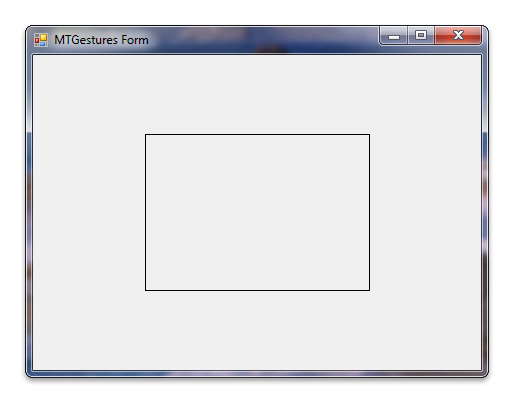

# Windows Touch Gestures in C# Sample (MTGesturesCS)

This section describes the Windows Touch Gestures sample in C#.

This Windows Touch Gestures sample demonstrates how to use gesture messages to translate, rotate, and scale a box rendered by the Graphics Device Interface (GDI) by handling the [**WM\_GESTURE**](wm-gesture.md) message. The following screen shot shows how the sample looks when it is running.



For this sample, gesture messages are passed to a gesture engine which then calls methods on drawing objects to translate, rotate, and scale an object that has methods for handling these commands. To make this possible in C#, a special form, TouchableForm, is created to handle gesture messages. This form then uses the messages to make changes on a drawing object, DrawingObject, to change how the object renders in the Paint method.

To help show how the sample works, consider the steps for using the pan command to translate the rendered box. A user performs the pan gesture which generates a [**WM\_GESTURE**](wm-gesture.md) message with the gesture identifier GID\_PAN. The TouchableForm handles this messages and updates the position of the drawing object, and the object will then render itself translated.

The following code shows how the gesture handler retrieves parameters from the [**WM\_GESTURE**](wm-gesture.md) message and then performs translation on the rendered box through a call to the drawing object's move method.


```CSharp
            switch (gi.dwID)
            {
                case GID_BEGIN:
                case GID_END:
                    break;
               (...)
                case GID_PAN:
                    switch (gi.dwFlags)
                    {
                        case GF_BEGIN:
                            _ptFirst.X = gi.ptsLocation.x;
                            _ptFirst.Y = gi.ptsLocation.y;
                            _ptFirst = PointToClient(_ptFirst);
                            break;

                        default:
                            // We read the second point of this gesture. It is a
                            // middle point between fingers in this new position
                            _ptSecond.X = gi.ptsLocation.x;
                            _ptSecond.Y = gi.ptsLocation.y;
                            _ptSecond = PointToClient(_ptSecond);

                            // We apply move operation of the object
                            _dwo.Move(_ptSecond.X - _ptFirst.X, _ptSecond.Y - _ptFirst.Y);

                            Invalidate();

                            // We have to copy second point into first one to
                            // prepare for the next step of this gesture.
                            _ptFirst = _ptSecond;
                            break;
                    }
                    break;
```


The following code shows how the drawing object's move method updates internal position variables.


```CSharp
        public void Move(int deltaX,int deltaY)
        {
            _ptCenter.X += deltaX;
            _ptCenter.Y += deltaY;
        }
```


The following code shows how the position is used in the drawing object's paint method.


```CSharp
public void Paint(Graphics graphics)
        {
(...)
            for (int j = 0; j < 5; j++)
            {
                int idx = arrPts[j].X;
                int idy = arrPts[j].Y;

                // rotation
                arrPts[j].X = (int)(idx * dCos + idy * dSin);
                arrPts[j].Y = (int)(idy * dCos - idx * dSin);

                // translation
                arrPts[j].X += _ptCenter.X;
                arrPts[j].Y += _ptCenter.Y;
            }
(...)
        }
```


Pan gestures will cause the drawn box to be rendered translated.

## Related topics

<dl> <dt>

[Windows Touch Samples](windows-touch-samples.md)
</dt> </dl>

 

 


