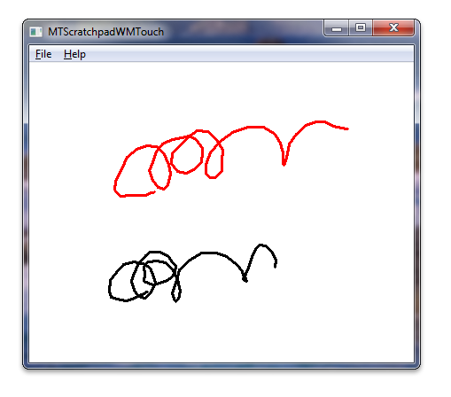

# Windows Touch Scratchpad Sample (MTScratchpadWMTouch)

This section describes the Windows Touch Scratchpad sample.

The Windows Touch Scratchpad sample shows how to use Windows Touch messages to draw traces of the touch points to a window. The trace of the primary finger, the one that was put on the digitizer first, is drawn in black. Secondary fingers are drawn in six other colors: red, green, blue, cyan, magenta, and yellow. The following image shows how the application could look while running.



For this application, the window is registered as a touch window, touch messages are interpreted to add touch points to stroke objects, and ink strokes are rendered to the screen in the **WM\_PAINT** message handler.

The following code shows how the window is registered as a touch window.


```C++
    // Register application window for receiving multitouch input. Use default settings.
    if(!RegisterTouchWindow(hWnd, 0))
    {
        MessageBox(hWnd, L"Cannot register application window for multitouch input", L"Error", MB_OK);
        return FALSE;
    }    
```


The following code shows how touch messages are used to add touch points to ink strokes.


```C++
        // WM_TOUCH message handlers
        case WM_TOUCH:
            {
                // WM_TOUCH message can contain several messages from different contacts
                // packed together.
                // Message parameters need to be decoded:
                unsigned int numInputs = (unsigned int) wParam; // Number of actual per-contact messages
                TOUCHINPUT* ti = new TOUCHINPUT[numInputs]; // Allocate the storage for the parameters of the per-contact messages
                if(ti == NULL)
                {
                    break;
                }
                // Unpack message parameters into the array of TOUCHINPUT structures, each
                // representing a message for one single contact.
                if(GetTouchInputInfo((HTOUCHINPUT)lParam, numInputs, ti, sizeof(TOUCHINPUT)))
                {
                    // For each contact, dispatch the message to the appropriate message
                    // handler.
                    for(unsigned int i=0; i<numInputs; ++i)
                    {
                        if(ti[i].dwFlags & TOUCHEVENTF_DOWN)
                        {
                            OnTouchDownHandler(hWnd, ti[i]);
                        }
                        else if(ti[i].dwFlags & TOUCHEVENTF_MOVE)
                        {
                            OnTouchMoveHandler(hWnd, ti[i]);
                        }
                        else if(ti[i].dwFlags & TOUCHEVENTF_UP)
                        {
                            OnTouchUpHandler(hWnd, ti[i]);
                        }
                    }
                }
                CloseTouchInputHandle((HTOUCHINPUT)lParam);
                delete [] ti;
            }
            break;
```


The following code shows how the ink strokes are drawn to the screen in the **WM\_PAINT** message handler.


```C++
        case WM_PAINT:
            hdc = BeginPaint(hWnd, &ps);
            // Full redraw: draw complete collection of finished strokes and
            // also all the strokes that are currently in drawing.
            g_StrkColFinished.Draw(hdc);
            g_StrkColDrawing.Draw(hdc);
            EndPaint(hWnd, &ps);
            break;
```


The following code shows how the stroke object renders strokes to the screen.


```C++
void CStroke::Draw(HDC hDC) const
{
    if(m_nCount < 2)
    {
        return;
    }

    HPEN hPen = CreatePen(PS_SOLID, 3, m_clr);
    HGDIOBJ hOldPen = SelectObject(hDC, hPen);
    Polyline(hDC, m_arrData, m_nCount);
    SelectObject(hDC, hOldPen);
    DeleteObject(hPen);
}
```


## Related topics

<dl> <dt>

[Windows Touch Samples](windows-touch-samples.md)
</dt> </dl>

 

 


