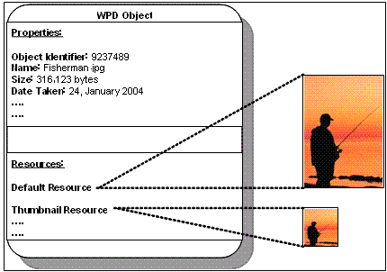
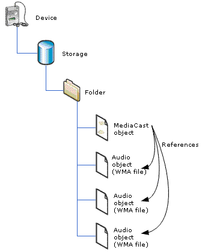

# The Conceptual Model

This section describes the objects, properties, and resources that constitute the WPD conceptual model.

### Objects

In WPD, logical entities on devices are referred to as objects. Typically, but not always, these represent data on the device. Objects have properties, and are referenced by object identifiers. Examples of objects include pictures and folders on a camera, songs and playlists on a media player, contacts on a mobile phone, and so on.

Objects can also represent functional or informational parts of the device. Examples of these include player controls (play/record/pause), camera settings, a mobile phone's SMS capabilities, and so on.

The two following topics give examples and illustrations of two types of objects: the Image object and the Mediacast object.

### Image Object

An image object represents a still image. The following diagram shows the relationships between an Image object, its properties, and its resources.



For more information about the Image object and its properties, see the [**WPD\_CONTENT\_TYPE\_IMAGE**](wpd-content-type-image.md) topic.

### Mediacast Object

A Mediacast object can be thought of as a container object that groups related content, just as a playlist groups music. Often, a Mediacast object is used to group media content that was published online. For example, an RSS channel can be represented as a Mediacast object whose object references point to content objects that represent each item in the channel. The following diagram shows the relationship between a Mediacast object and the three audio objects it contains.



The references to the audio object are specified in the [WPD\_OBJECT\_REFERENCES](object-properties.md#wpd-object-references) property for the Mediacast object. For more information about the properties supported by a Mediacast object, see the [**WPD\_CONTENT\_TYPE\_MEDIA\_CAST**](wpd-content-type-media-cast.md) topic.

### Properties

Object properties provide a mechanism for exchanging object-describing metadata. For example, an image object may include properties that describe its filename, size, format, width in pixels, and so on.

Properties have a current value, as well as attributes. WPD defines a set of standard properties that make up the API and DDI definitions. Vendors are not limited to the predefined WPD properties and are free to add their own.

### Property Attributes

Property attributes describe the access rights, valid values, and other information related to a property. For example, the property representing bit rate could be a range from 8 kilobits per second (Kbps) to 20 Kbps with a step value of 1 Kbps.

Access rights indicate whether callers can read, write and/or delete the property. Valid values indicate restrictions for property values. Valid values are said to be of a specific form. Valid value forms include Range (that is, property can take a value from Min to Max with specified Step), Enumeration (that is, property value is one of those in the specified List), and None (that is, there are no specific valid values).

### Resources

Resources are placeholders for binary data. An object can have more than one resource. For example, if the object represented an image file with an audio annotation, then the resources for this object might be as follows:

-   A default resource. This resource represents the entire image file. (This includes any embedded data such as audio annotations, thumbnails, and so on)
-   A thumbnail resource. This resource represents the thumbnail data for the image.
-   An audio annotation resource. This resource represents the audio data associated with the image.

### Resource Attributes

Similar to property attributes, resource attributes describe the access rights, size, format, and other information related to a resource. For example, the attributes for an audio annotation resource on an image object may specify the bit rate, channel count, and data format of the audio.

### Rendering Profiles and Resource Attributes

The rendering profile is one method that applications use to discover the valid attributes for a given resource. For example, a mobile phone may support bitmaps with specific restrictions on the minimum and maximum width and height values. By querying the rendering profiles for the bitmap object, an application can retrieve those exact values.

The following sample output identifies the rendering profile information that the device would return if it supported bitmaps with a minimum height of 10 pixels, a minimum width of 20 pixels, a maximum height of 1000 pixels and a maximum width of 2000 pixels.


```C++
WPD_OBJECT_FORMAT = WPD_OBJECT_FORMAT_BMP
WPD_MEDIA_HEIGHT:
        WPD_PROPERTY_ATTRIBUTE_FORM = WPD_PROPERTY_ATTRIBUTE_FORM_RANGE
        WPD_PROPERTY_ATTRIBUTE_DEFAULT_VALUE =  10
        WPD_PROPERTY_ATTRIBUTE_RANGE_MIN =  10 
        WPD_PROPERTY_ATTRIBUTE_RANGE_MAX = 1000
        WPD_PROPERTY_ATTRIBUTE_RANGE_STEP = 1
WPD_MEDIA_WIDTH:
        WPD_PROPERTY_ATTRIBUTE_FORM = WPD_PROPERTY_ATTRIBUTE_FORM_RANGE
        WPD_PROPERTY_ATTRIBUTE_DEFAULT_VALUE =  20 
        WPD_PROPERTY_ATTRIBUTE_RANGE_MIN =  20 
        WPD_PROPERTY_ATTRIBUTE_RANGE_MAX =  2000
        WPD_PROPERTY_ATTRIBUTE_RANGE_STEP = 1
WPD_RESOURCE_ATTRIBUTE_TOTAL_SIZE:
        WPD_PROPERTY_ATTRIBUTE_FORM = WPD_PROPERTY_ATTRIBUTE_FORM_RANGE
        WPD_PROPERTY_ATTRIBUTE_DEFAULT_VALUE = 0
        WPD_PROPERTY_ATTRIBUTE_RANGE_MIN =  2000 
        WPD_PROPERTY_ATTRIBUTE_RANGE_MAX = 1000000
        WPD_PROPERTY_ATTRIBUTE_RANGE_STEP = 1
```


See the [Retrieving the Rendering Capabilities Supported by a Device](retrieving-the-rendering-capabilities-supported-by-a-device.md) topic in the programming guide for a description of how your application can retrieve a rendering profile (and the associated resource attributes).

## Related topics

<dl> <dt>

[**Application Overview**](application-overview.md)
</dt> </dl>

 

 


