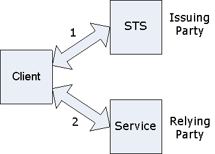

# Federation

Federation allows the delegation of authorization authority to other members of an interprise. For example, consider the following business problem: The auto parts manufacturing company Contoso Ltd would like to allow authorized employees of its customer Fabrikam Inc to securely access Contoso's parts order Web Service. One security solution for this scenario is for Contoso to set up a trust mechanism with Fabrikam to delegate the access authorization decision to Fabrikam. This process could work as follows:

-   Fabrikam, when it becomes a partner of Contoso, sets up a trust agreement with Contoso. The goal of this step is to agree on the security token type and content that will represent Fabrikam's authorization and will be acceptable to Contoso. For example, it may be decided that a trusted X.509 certificate with subject name "CN=Fabrikam Inc Supplier STS" should sign a SAML token for that SAML to be accepted by the Contoso Web Service. Further, it may be decided that the security claim in the issued SAML token should be either 'https://schemas.contoso.com/claims/lookup' (for part lookup authorization) or 'https://schemas.contoso.com/claims/order' (for part ordering authorization).
-   When a Fabrikam employee uses the internal parts ordering application, it first contacts a security token service (STS) inside Fabrikam. That employee is authenticated using the internal Fabrikam security mechanism (say, Windows domain username/password), his authorization to order parts is verified, and he is issued a short lived SAML token containing the appropriate claims and signed by the X.509 certificate decided above. The parts ordering application then contacts the Contoso service presenting the issued SAML token to authenticate and perform the ordering task.

Here, the Fabrikam STS acts as the 'issuing party' and the Contoso parts service acts as the 'relying party'. 

## Federation Features

The following are the supported security features for the parties or roles involved in a federation scenario:

-   Client-side: For obtaining the security token from the STS, one may use [**WsRequestSecurityToken**](/windows/desktop/api/WebServices/nf-webservices-wsrequestsecuritytoken) function. Alternatively, one may use a client side security token provider library such as CardSpace or LiveID, and then use their output to locally create a security token using [**WsCreateXmlSecurityToken**](/windows/desktop/api/WebServices/nf-webservices-wscreatexmlsecuritytoken). Either way, once the client has the security token, it may then create a channel to the service specifying [**WS\_XML\_TOKEN\_MESSAGE\_SECURITY\_BINDING**](/windows/desktop/api/WebServices/ns-webservices-_ws_xml_token_message_security_binding) to present the token, together with a transport security binding such as [**WS\_SSL\_TRANSPORT\_SECURITY\_BINDING**](/windows/desktop/api/WebServices/ns-webservices-_ws_ssl_transport_security_binding) to protect the channel.
-   Server-side: In a federation scenario with a security token service that issues SAML tokens, the server may use the [**WS\_SAML\_MESSAGE\_SECURITY\_BINDING**](/windows/desktop/api/WebServices/ns-webservices-_ws_saml_message_security_binding), together with a transport security binding such as [**WS\_SSL\_TRANSPORT\_SECURITY\_BINDING**](/windows/desktop/api/WebServices/ns-webservices-_ws_ssl_transport_security_binding) to protect the channel.
-   STS-side: Note that the STS is a Web Service application, and it can specify the security requirements for those requesting a security token from it using a [**security description**](/windows/desktop/api/WebServices/ns-webservices-_ws_security_description) structure at listener creation time just as any other secure Web Service would. It may then parse incoming request message payloads to validate the token requests and send back issued tokens as reply message payloads. Currently, no features are provided to help these parsing and issuing steps.

Note that the client side can handle the issued security token generically as an XML security token without knowing the token type, or doing token type specific processing. However, the server has to understand the specific security token type in order to understand and process it. The security token request and response steps use the constructs defined in the WS-Trust specification.

## More Complex Federation Scenarios

A federation scenario may involve multiple STSs that form a federation chain. Consider the following example:

-   Client authenticates to the LiveID STS using a LiveID username/password, and obtains a security token T1.
-   Client authenticates to STS1 using T1 and obtains a security token T2.
-   Client authenticates to STS2 using T2 and obtains a security token T3.
-   Client authenticates to the target service S using T3.

Here, the LiveID STS, STS1, STS2 and S form the federation chain. The STSs in a federation chain may perform various roles for the overall application scenario. Examples of such STS functional roles include identity provider, authorization decision maker, anonymizer, and resource manager.

## STS Request Parameters and Metadata Exchange

For the client to make a successful [**WsRequestSecurityToken**](/windows/desktop/api/WebServices/nf-webservices-wsrequestsecuritytoken) call, it needs to know the parameters of that call (such as the required token type and claim types), the [**security description**](/windows/desktop/api/WebServices/ns-webservices-_ws_security_description) requirements of the request channel to the STS, and the [endpoint address](endpoint-address.md) of the STS. The client application may use any of the following techniques for determining this information:

-   Hard code the information in the application as part of the design time decisions.
-   Read this information from an application level configuration file set up by the local application deployer.
-   Dynamically discover this information at runtime using the [metadata import](metadata-import.md) feature with the [**WS\_ISSUED\_TOKEN\_MESSAGE\_SECURITY\_BINDING\_CONSTRAINT**](/windows/desktop/api/WebServices/ns-webservices-_ws_issued_token_message_security_binding_constraint) structure.

To illustrate the use of dynamic MEX with federation, consider the 3 STS example above. The client will first do a dynamic MEX with S to obtain information about T3 (i.e., what to ask from STS2) as well as the STS2 dynamic MEX address (i.e., where to find STS2). It will then use that information to do a dynamic MEX with STS2 to discover information about T2 and STS1, and so on.

Thus, the dynamic MEX steps take place in the order 4, 3, 2, 1 to build up the federation chain and the token request and presentation steps take place in the order 1, 2, 3, 4 to unwind the federation chain.

> [!Note]  
> Windows 7 and Windows Server 2008 R2: WWSAPI only supports [Ws-Trust](https://specs.xmlsoap.org/ws/2005/02/trust/WS-Trust.pdf) and [Ws-SecureConversation](https://specs.xmlsoap.org/ws/2005/02/sc/WS-SecureConversation.pdf) as defined by [Lightweight Web Services Security Profile (LWSSP)](https://msdn.microsoft.com/library/dd357239(PROT.10).aspx). For details regarding Microsoft's implementation please see the [MESSAGE Syntax](https://docs.microsoft.com/openspecs/windows_protocols/ms-lwssp/d4f0f509-e14a-47b5-81e8-ade06a51d1ed) section of LWSSP.

 

 

 

