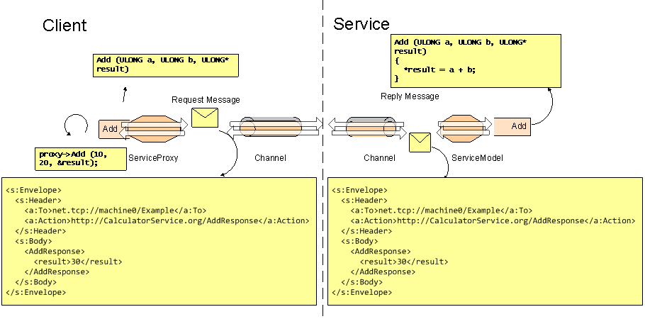
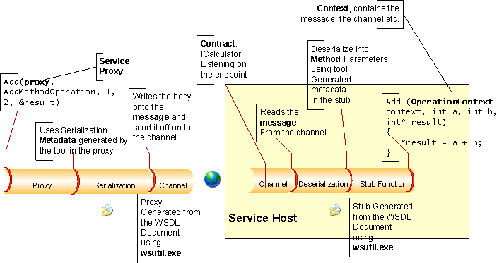

# Service Model Layer Overview

The WWSAPI Service Model API models the communication between a client and a service as method calls, rather than as data messages. In contrast to the [channel layer](channel-layer-overview.md), which supports more traditional [message](message.md) exchanges between client and service, the Service Model automatically manages communication by means of a service proxy on the client and a service host on the service. This means that the client calls generated functions and the server implements callbacks.

## 

For example, consider a calculator service which performs addition and subtraction on two numbers. Addition and subtraction are operations naturally represented as method calls.



The service model represents the communication between client and the service as declared method calls, and so conceals the communication details of the underlying channel layer from the application, making the service easier to implement.

## Specifying a Service

A service must be specified in terms of its message exchange patterns as well as its network data representation. For services, this specification is usually provided as WSDL and XML schema documents.

The WSDL document is an XML document which contains the channel binding and the message exchange patterns of the service, whereas the XML schema document is an XML document that defines the data representation of the individual messages.

For the calculator service and its addition and subtraction operations, the WSDL document might look like the following example:

``` syntax
<wsdl:definitions xmlns:soap="http://schemas.xmlsoap.org/wsdl/soap/" 
xmlns:wsu="http://docs.oasis-open.org/wss/2004/01/oasis-200401-wss-wssecurity-utility-1.0.xsd" 
xmlns:soapenc="http://schemas.xmlsoap.org/soap/encoding/" xmlns:tns="http://Example.org" 
xmlns:wsa="http://schemas.xmlsoap.org/ws/2004/08/addressing" xmlns:wsp="http://schemas.xmlsoap.org/ws/2004/09/policy" 
xmlns:wsap="http://schemas.xmlsoap.org/ws/2004/08/addressing/policy" xmlns:xsd="http://www.w3.org/2001/XMLSchema" 
xmlns:msc="http://schemas.microsoft.com/ws/2005/12/wsdl/contract" xmlns:wsaw="http://www.w3.org/2006/05/addressing/wsdl" 
xmlns:soap12="http://schemas.xmlsoap.org/wsdl/soap12/" xmlns:wsa10="http://www.w3.org/2005/08/addressing" 
xmlns:wsx="http://schemas.xmlsoap.org/ws/2004/09/mex" targetNamespace="http://Example.org" 
xmlns:wsdl="http://schemas.xmlsoap.org/wsdl/">
 <wsdl:portType name="ICalculator">
  <wsdl:operation name="Add">
   <wsdl:input wsaw:Action="http://Example.org/ICalculator/Add" 
   message="tns:ICalculator_Add_InputMessage" />
   <wsdl:output wsaw:Action="http://Example.org/ICalculator/AddResponse" 
   message="tns:ICalculator_Add_OutputMessage" />
  </wsdl:operation>
 </wsdl:portType>
</wsdl:definitions>
```

Likewise, its XML schema can be defined as follows:

``` syntax
<xs:schema xmlns:tns="http://Example.org" elementFormDefault="qualified" 
targetNamespace="http://Example.org" xmlns:xs="http://www.w3.org/2001/XMLSchema">
 <xs:element name="Add">
  <xs:complexType>
   <xs:sequence>
    <xs:element minOccurs="0" name="a" type="xs:int" />
    <xs:element minOccurs="0" name="b" type="xs:int" />
   </xs:sequence>
  </xs:complexType>
 </xs:element>
 <xs:element name="AddResponse">
  <xs:complexType>
   <xs:sequence>
    <xs:element minOccurs="0" name="result" type="xs:int" 
    />
   </xs:sequence>
  </xs:complexType>
 </xs:element>
</xs:schema> 
```

## Converting Metadata to Code

The service model provides the [WsUtil.exe](web-service-compiler-tool.md) as a tool to process these metadata documents, converting a WSDL file into a C header and source files.


The [WsUtil.exe](web-service-compiler-tool.md) generates header and sources for service implementation as well as client-side service operations for the client .

## Calling the Calculator Service From a Client

As with the service implementation, the client must include the generated header or headers.

``` syntax
#include "CalculatorProxyStub.h"
```

Now, The client application can create and open a service proxy to begin communication with the calculator service.

``` syntax
WS_ENDPOINT_ADDRESS address = {0};
WS_STRING uri= WS_STRING_VALUE(L"http://localhost/example");
address.uri = uri;

if (FAILED (hr = WsCreateServiceProxy(WS_CHANNEL_TYPE_REQUEST, WS_HTTP_CHANNEL_BINDING, NULL, NULL, 0, &serviceProxy, error)))
    goto Error;

if (FAILED (hr = WsOpenServiceProxy(serviceProxy, &address, NULL, error)))
    goto Error;
```

The application can call the Add operation on the calculator service with the following code:

``` syntax
if (FAILED (hr = DefaultBinding_ICalculator_Add(serviceProxy, heap, 1, 2, &result, NULL, 0, NULL, error)))
    goto Error;
```

Please refer to the code example at [HttpCalculatorClientExample](httpcalculatorclientexample.md) for full implementation of the calculator service.

## Service Model Components

The interaction of the individual WWSAPI Service Model components within the Calculator example is as follows:

-   The client creates a [service proxy](service-proxy.md) and opens it.
-   The client calls the Add function of the service, and passes in the service proxy.
-   The message is serialized according to the serialization metadata in the header and source files generated by the metadata tool ([WsUtil.exe](web-service-compiler-tool.md)).
-   The message is written to the channel and is transmitted over the network to the service.
-   On the server side, the service is hosted inside a service host, and has an endpoint listening for the ICalculator contract.
-   Using the Service Model metadata in the stub, the service deserializes the message from the client and dispatches it to the stub.
-   The server-side service calls the Add method, passing it the operation context. This operation context contains the reference to the incoming message.



Components

-   [Service host](service-host.md): Hosts a service.
-   [Service proxy](service-proxy.md): Defines how a client communicates with a service.
-   [Context](context.md): Property bag for making state-specific information available to a service operation.
-   [Contract](contract.md): The interface definition of a service. For example, ICalculator represents a contract for the calculator service in our example code.
-   [WsUtil.exe](web-service-compiler-tool.md): The Service Model metadata tool for generating proxies and stubs.

 

 


